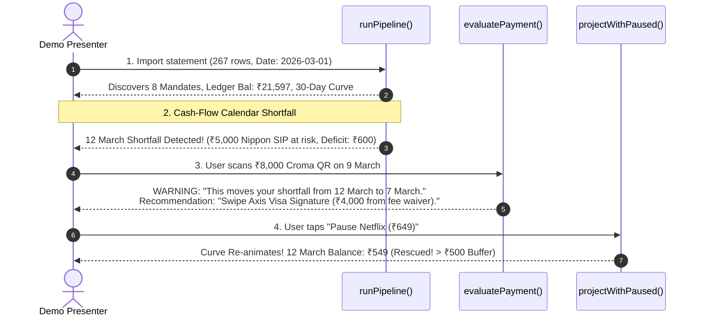

# `@tixpay/engine` — Analytical & Predictive Engine

> **Zero-integration, on-device cash-flow guard for UPI users.**
> Built with pure TypeScript, zero platform/UI dependencies, and deterministic time-travel testing.

---

## 📋 Table of Contents

1. [Architecture & Design Principles](#1-architecture--design-principles)
2. [Implemented Features & Business Logic](#2-implemented-features--business-logic)
   - [Phase 1: Foundation & UPI DeepLink Parser](#21-foundation--upi-deeplink-parser)
   - [Phase 2: Statement Parser & Mandate Discovery](#22-statement-parser--mandate-discovery)
   - [Phase 3: Shadow Ledger & Forward Balance Curve](#23-shadow-ledger--forward-balance-curve)
   - [Phase 4: Guard, Attribution, Router & Pre-Payment Intercept](#24-guard-attribution-router--pre-payment-intercept)
   - [Phase 5: The Grand Pipeline Integration](#25-the-grand-pipeline-integration)
3. [Module-by-Module Technical Deep Dive](#3-module-by-module-technical-deep-dive)
4. [Testing & Scenario Verification](#4-testing--scenario-verification)
5. [Test Suite & Demo Scenario Walkthrough](#5-test-suite--demo-scenario-walkthrough)

---

## 1. Architecture & Design Principles

The `@tixpay/engine` package is built to satisfy strict architectural invariants:

- **100% Pure TypeScript:** Zero React, zero React Native, zero Android/iOS native dependencies. Can run in Node.js, Bun, Web Workers, or React Native JS runtime.
- **Deterministic Time-Travel Architecture:** No function inside the engine logic calls `new Date()` without arguments. Every function accepts an explicit `now: Date` parameter. This allows the simulator and world-clock slider to shift "today" forward/backward deterministically.
- **Fail-Safe & Non-Throwing:** The engine never throws unhandled exceptions. A malformed statement, an unrecognised counterparty, or an invalid URL returns `null`, an empty result with a populated `errors` list, or `{ confidence: 0 }`. A parser that throws on row 4,000 of someone's statement is a parser that loses the whole file.
- **Paise Integer Accumulation:** While the public interface exports amounts in Rupees (2dp), internal accumulation and projections are computed in paise integers to eliminate floating-point rounding errors.
- **IST Timezone Awareness (+5:30):** All day-key calculations (`YYYY-MM-DD`) and calendar offsets are evaluated against Indian Standard Time (IST) to prevent UTC midnight boundary shifts.

---

## 2. Implemented Features & Business Logic

### 2.1 Foundation & UPI DeepLink Parser
- **UPI QR Code Parser (`src/parse/deepLink.ts`):** Parses genuine merchant QR deep links (`upi://pay?pa=...&am=...&mc=...` and Android `intent://` wrappers). Extracts `vpa`, `payeeName`, `amount`, and `mcc` (Merchant Category Code). Generates deterministic transaction references (`TPxxxxxxx`).

### 2.2 Statement Parser & Mandate Discovery

**Bank statement (CSV) ingestion is the only input path.** The user picks one exported file
through the system picker; no permission is held and nothing else on the device is readable.

- **CSV Tokeniser (`src/parse/csv.ts`):** Dependency-free RFC 4180 tokeniser plus delimiter
  detection (`,` `	` `;` `|`). Bank exports are not clean CSV — preamble rows, ragged
  lengths, CRLF, BOMs, and quoted narrations containing commas — and a naive `split(',')`
  shears those narrations in half.
- **Statement Parser (`src/parse/statement.ts`):**
  - **Tolerant column binding** across export layouts (HDFC `Withdrawal Amt.`/`Deposit Amt.`,
    ICICI `Transaction Remarks`, SBI `Debit`/`Credit`, single-`Amount` + `Dr/Cr` variants).
    Binding runs in two passes — every exact header match is claimed before any fuzzy one is
    considered — and aliases of three characters or fewer are exact-only, so a `Dr/Cr`
    direction column is never mistaken for a debit-amount column.
  - **Header discovery** walks past the account-summary preamble every Indian bank writes
    above the table, and mines it for bank name and account tail (last four digits only).
  - **Day-first date parsing** (`26/03/26`, `26-Mar-2026`, `2026-03-26`, …) with a
    per-row minute offset that preserves the file's own ordering for same-day rows.
  - **Counterparty extraction:** the narration is split into fields *before* the VPA pattern
    is applied, so `UPI-NETFLIX-netflix.rzp@icici-ICIC-4123` yields `netflix.rzp@icici` and
    not the rail prefix. Narrations with no VPA — the NACH and ECS rails that carry the EMIs
    and premiums actually worth warning about — get a stable synthesised key from the
    merchant words, with reference numbers stripped.
  - Extracts `direction`, `amount`, `vpa`, `accountTail`, `balanceHint`, `refNo`, `isFailure`.
  - Returns an **import receipt** (`meta`): rows read, rows parsed, columns bound, rows
    skipped and why. "We read 412 of 418 rows" is a claim the user can check.
- **Mandate Discovery Engine (`src/detect/mandates.ts`):** Discovers recurring auto-debits without bank APIs.
  - Normalizes VPAs by stripping order numbers and transaction handles (`swiggy.payu.98241@hdfcbank` → `swiggy.payu@hdfcbank`).
  - Buckets transactions by `(normalizedVpa, amount ±5%)`.
  - Computes consecutive inter-arrival day gaps and takes the **median gap** (28–31d = `MONTHLY`, 6–8d = `WEEKLY`, 89–92d = `QUARTERLY`).
  - Requires $\ge 3$ occurrences and computes confidence score $C = 0.6 \times \text{countScore} + 0.4 \times \text{varianceScore}$.
  - Ranks mandates into domain categories & priorities:
    $$\text{EMI (Critical)} > \text{SIP (Critical)} > \text{Insurance (High)} > \text{Utility (Medium)} > \text{OTT (Low)}$$

### 2.3 Shadow Ledger & Forward Balance Curve
- **Shadow Ledger (`src/project/ledger.ts`):** Reconstructs account balance chronologically from debit/credit transactions, snapping to the statement's stated running balance on every row that carries one.
  - `drift` measures the error of our *inference* over a gap where nothing was stated. Two cases are excluded from it, for the same reason — neither measures inference error: the first hint (bootstrap, not drift) and any hint following another hint with nothing inferred between them. On a statement with a running-balance column, drift is therefore **structurally zero**, and the ledger stops being a shadow.
- **Income Inference (`src/project/income.ts`):** Detects recurring credit streams:
  - **Salaried Income:** Fixed amount ($\pm 5\%$) landing on the same day of month ($\pm 2$ days).
  - **Irregular Income:** Variable freelance payouts evaluated over a rolling window.
- **30-Day Forward Balance Projection (`src/project/curve.ts`):** Emits an exact 30-point `BalancePoint` array starting from `now`. Applies recurring mandates and projected income events on their future due dates. Supports `projectWithPaused` for instant UI re-animation on intervention.

### 2.4 Guard, Attribution, Router & Pre-Payment Intercept
- **Bounce Guard (`src/guard/index.ts`):**
  - `findShortfalls()`: Scans the balance curve for contiguous days dipping below the ₹500 safety buffer. Maps all mandates at risk.
  - `proposeInterventions()`: Evaluates candidate remedies. Generates **SWEEP** (transfer funds in) or **PAUSE** (defer non-critical mandates like Netflix) to rescue critical SIPs/EMIs.
- **Cause Attribution (`src/attribute/index.ts`):** `classifyFailure()` checks if historical failures were due to `LIQUIDITY` (balance < debit amount) or `INTENTIONAL` (user stopped it). Returns `UNKNOWN` if no balance hint exists within 7 days.
- **Smart Payment Router (`src/route/index.ts`):** 
  - `resolveMcc()`: Matches VPA against `data/vpa_patterns.json` regex map or uses QR `mc` param.
  - `recommendInstrument()`: Evaluates user cards against category exclusions, reward caps, and fee-waiver proximity. Advises **card swipe over UPI** if the user is close to an annual fee waiver.
- **Pre-Payment Intercept (`src/evaluate/index.ts`):** The headline API `evaluatePayment()`.
  - Simulates a payment by cloning the shadow ledger and adding a hypothetical debit at `now`.
  - Compares shortfalls between the original timeline and hypothetical timeline.
  - Detects if the payment creates a new shortfall or pulls an existing shortfall earlier.
  - Returns a `WARNING` or `ADVISORY` verdict with human-readable headlines (*"This moves your shortfall from 12 March to 7 March. Your ₹1,899 LIC Premium will bounce earlier."*).

### 2.5 The Grand Pipeline Integration
- **Unified Entry Point (`src/pipeline.ts`):** `runPipeline(inbox, now)` executes all 4 phases and returns a single unified `PipelineResult` containing `txns`, `ledger`, `mandates`, `income`, `curve`, `shortfalls`, `interventions`, and `stats`. Binds directly into Person C's Zustand store.

---

## 3. Module-by-Module Technical Deep Dive

| Directory / File | Key Function | Responsibility |
|---|---|---|
| `src/types.ts` | — | Domain interfaces & shared data contracts |
| `src/money.ts` | `toPaise`, `parseAmount` | Safe currency conversion & Indian lakh grouping |
| `src/time.ts` | `istDayKey`, `formatIstDate` | IST timezone conversions & date formatting |
| `src/parse/csv.ts` | `parseCsv()`, `detectDelimiter()` | RFC 4180 tokeniser and delimiter detection |
| `src/parse/statement.ts` | `parseStatementCsv()` | Bank statement → `Transaction[]` plus an import receipt |
| `src/parse/deepLink.ts` | `parseUpiDeepLink()` | Standard UPI intent & QR code parser |
| `src/detect/mandates.ts` | `detectMandates()` | Median-gap recurring mandate discovery |
| `src/project/ledger.ts` | `buildLedger()` | Reconstructed shadow ledger & drift calculation |
| `src/project/income.ts` | `inferIncomeEvents()` | Salary & irregular freelance credit detection |
| `src/project/curve.ts` | `projectBalance()` | 30-day forward balance curve generation |
| `src/guard/index.ts` | `proposeInterventions()` | Shortfall detection & one-tap remedies |
| `src/attribute/index.ts` | `classifyFailure()` | Failed transaction cause attribution |
| `src/route/index.ts` | `recommendInstrument()` | MCC resolution & credit card optimization |
| `src/evaluate/index.ts` | `evaluatePayment()` | Headline pre-payment hypothetical intercept |
| `src/pipeline.ts` | `runPipeline()` | Single-entry pipeline for app state integration |

---

## 4. Testing & Scenario Verification

### Automated Unit & Integration Tests
Run the entire Vitest suite (15 test files, 253 tests):
```bash
pnpm --filter @tixpay/engine test
```

Strict TypeScript check:
```bash
pnpm --filter @tixpay/engine typecheck
```

### Live Demo Pitch Scenario Script
Run the automated pitch script that simulates the live 2-minute stage presentation:
```bash
pnpm --filter @tixpay/engine exec tsx scripts/use_case_demo.ts
```

---

## 5. Test Suite & Demo Scenario Walkthrough

The engine is protected by **15 test files containing 253 passing tests**. Below is a detailed walkthrough of what each test suite verifies.

### 5.1 Test Files Breakdown

| Test File | Tests | Focus Area & Verified Behavior |
|---|---|---|
| `test/purity.test.ts` | 56 | **Architectural Rules:** Scans source files to enforce 0 `new Date()` calls without arguments, 0 React/Native dependencies, and pure TS exports. |
| `test/useCase.test.ts` | 4 | **Live Demo Pitch Script:** End-to-end walkthrough of the 4 key stage demo beats (Initial State, Shortfall Detection, Pre-Payment Intercept, Bounce Guard Resolution). |
| `test/pipeline.test.ts` | 30 | **Pipeline Integration:** Verifies `runPipeline()` end-to-end stats, parse floor (>70%), single account reconciliation (`4471`), and strict determinism. |
| `test/statement.test.ts` | 47 | **Statement ingestion:** tokeniser edge cases, header binding across five bank layouts, every date and amount format, counterparty extraction, and refusal behaviour on files that are not statements. |
| `test/appStore.test.ts` | 23 | **App wiring:** drives the real Zustand store through import → intercept → pay → rescue. Catches buttons wired to nothing, which typechecking cannot. |
| `test/project.test.ts` | 32 | **Shadow Ledger & Projections:** Verifies chronological ledger walks, balance hint snapping, zero drift, and 30-point curve generation. |
| `test/deepLink.test.ts` | 29 | **UPI QR Code Parsing:** Verifies `parseUpiDeepLink()` on static QRs, amount extraction, VPA shapes, and Android `intent://` URL wrappers. |
| `test/demoCorpus.test.ts` | 25 | **Synthetic Corpus Generator:** Asserts that seed 42 produces 468 messages with exact expected mandate counts and shortfall dates. |
| `test/time.test.ts` | 8 | **IST Timezone Math:** Verifies `istDayKey`, `startOfIstDay`, `daysBetween`, and calendar month advancement across leap years & February boundaries. |
| `test/fixtures.test.ts` | 7 | **Static Datasets:** Validates `cards.json`, `mcc_map.json`, and `vpa_patterns.json` schema integrity. |
| `test/route.test.ts` | 6 | **Card Router:** Verifies `resolveMcc()` confidence scores, reward caps, and fee-waiver proximity recommendations. |
| `test/money.test.ts` | 6 | **Currency Math:** Validates `toPaise`, `toRupees`, `round2`, `roundUpTo500`, and Indian lakh comma string parsing (`1,25,000.00`). |
| `test/detect.test.ts` | 3 | **Mandate Engine:** Verifies VPA normalization and median-gap recurring auto-debit discovery. |
| `test/guard.test.ts` | 3 | **Bounce Guard:** Verifies priority ranking (`EMI > SIP > INSURANCE > UTILITY > OTT`) and candidate intervention proposal. |
| `test/attribute.test.ts` | 3 | **Failure Attribution:** Verifies `classifyFailure()` for `LIQUIDITY`, `INTENTIONAL`, and `UNKNOWN` cases. |
| `test/evaluate.test.ts` | 2 | **Pre-Payment Intercept:** Verifies hypothetical ledger cloning, shortfall shift detection, and headline string formatting. |

---

### 5.2 Step-by-Step Pitch Scenario Walkthrough (`useCase.test.ts`)

The end-to-end scenario script (`scripts/use_case_demo.ts` and `test/useCase.test.ts`) simulates the exact 2-minute live demo on stage:



#### Step 1: Initializing App State (1 March 2026)
- **Action:** User imports a statement. `runPipelineFromStatement(csv, NOW)` reads 267 rows.
- **Output:** 
  - 343 financial transactions extracted (73.3% parse yield).
  - Primary account reconciled: **A/c 4471** (Shadow balance: ₹21,597, Drift: ₹0).
  - Surfaced 8 mandates: Bajaj Finserv EMI (₹12,450), Nippon India SIP (₹5,000), Groww SIP (₹2,000), LIC Premium (₹1,899), JioFiber (₹249), BESCOM Electricity (₹1,450), Netflix (₹649), Hotstar (₹299).

#### Step 2: Shortfall Detection on 12 March 2026 (Beat 5)
- **Action:** The 30-day balance curve is projected forward from 1st March.
- **Output:** On 12th March, the ₹5,000 Nippon India SIP fires. The balance drops below the ₹500 safety buffer to -₹100 (Deficit: ₹600). The app flags **1 Shortfall** with ₹250 penalty at risk.

#### Step 3: Pre-Payment Intercept (Beat 8)
- **Action:** On 9th March, the user scans a ₹8,000 electronics QR at Croma (`upi://pay?pa=croma.store@icici&am=8000&mc=5732`). `evaluatePayment()` runs.
- **Output:**
  - **Verdict:** `WARNING`
  - **Headline:** `"This moves your shortfall from 12 March to 7 March."`
  - **Subline:** `"Your ₹1,899 LIC Premium will bounce earlier."`
  - **Card Router:** Recommends `CARD_SWIPE` using **Axis Visa Signature** (*"You're ₹4,000 from your fee waiver"*).

#### Step 4: Bounce Guard Resolution (Beat 9)
- **Action:** User taps the shortfall dip on the calendar and accepts the one-tap intervention: **Pause Netflix (₹649)**.
- **Output:** `projectWithPaused()` re-evaluates the curve. Restoring ₹649 from 7th March raises the 12th March balance to **+₹549**, safely above the ₹500 buffer. The SIP is saved, and the curve turns green!
